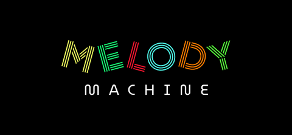
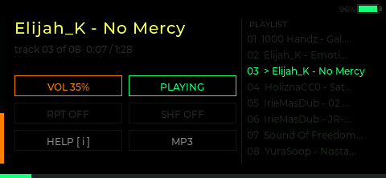
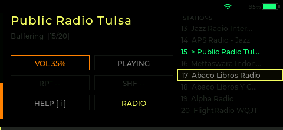

# Melody Machine

MP3 player and internet radio firmware for the **LilyGO T-LoRa Pager** (ESP32-S3).







---

## Features

- **MP3 Player** — plays MP3 files from SD card with folder browsing, shuffle, and repeat modes
- **Internet Radio** — streams internet radio via M3U playlists over WiFi (ICY metadata support)
- **LVGL UI** — graphical interface on the 480×222 TFT display with 4 switchable themes
- **WiFi Manager** — non-blocking WiFi with network list, password entry via on-screen keyboard, and auto-reconnect
- **Settings** — all settings persisted as JSON on SD card; survives reboots and reflashes
- **Dual-core audio** — MP3 decoding runs on Core 0 via FreeRTOS, keeping the UI responsive on Core 1

### Themes

| ID | Name | Style |
|----|------|-------|
| 0 | Default | Dark green |
| 1 | Windows 95 | Gray / navy |
| 2 | Fantasy | Dark purple / pink |
| 3 | Linux Console | CRT green on black |

---

## Hardware

| Component | Details |
|-----------|---------|
| MCU | ESP32-S3, dual-core Xtensa 240 MHz |
| Display | 480×222 ST7796U TFT, RGB565, SPI |
| Audio codec | ES8311 via I2S — speaker + headphone jack |
| Storage | MicroSD via SPI |
| Input | Physical QWERTY keyboard (TCA8418 I2C matrix) + rotary encoder |
| Connectivity | WiFi 802.11 b/g/n (built-in) |
| Board | LilyGO T-LoRa Pager |

---

## Controls

### File Browser

| Input | Action |
|-------|--------|
| Rotate encoder | Navigate list |
| Click encoder | Enter folder / play track |
| `P` or `SYM` | Toggle playback |
| `B` / Backspace | Go up one folder |
| `S` | Open settings |

### Player Screen

| Input | Action |
|-------|--------|
| Rotate encoder | Previous / Next track |
| Click encoder | Toggle pause |
| `P` | Toggle pause |
| `Q` / `W` | Volume −5 / +5 |
| `R` | Cycle repeat: off → one → all |
| `H` | Toggle shuffle |
| `B` | Back to browser |
| `S` | Open settings |

### Settings Screen

| Row | Description |
|-----|-------------|
| Brightness | Display brightness |
| Screen timeout | Auto-dim timer |
| KB backlight | Keyboard backlight (`ALT+B` anywhere) |
| Theme | Cycle through 4 themes |
| Mode | Switch between MP3 and Radio mode |
| WiFi network | Connect / manage networks |
| WiFi enable | Toggle WiFi on/off |
| Debug mode | Enable serial debug output |
| USB mode | USB serial / MSC |
| Restart / Power off | Device control |

---

## SD Card Layout

```
SD:/
├── config/
│   └── settings.json    ← auto-created on first boot
├── MP3/
│   └── **/*.mp3         ← music files (subdirectories supported)
└── M3U/
    └── *.m3u            ← internet radio playlists
```

### Example M3U playlist (`/M3U/stations.m3u`)

```
#EXTM3U
#EXTINF:-1,My Radio Station
http://stream.example.com/radio

#EXTINF:-1,Another Station
http://other.example.com/stream.mp3
```

### Adding WiFi networks

Edit `/config/settings.json` on the SD card (or use the WiFi screen in settings):

```json
{
  "wifi": {
    "networks": [
      { "ssid": "MyNetwork", "pass": "mypassword" }
    ]
  }
}
```

---

## Flashing Pre-built Firmware

Download `melody_machine.bin` from the [Releases](../../releases) page and flash with `esptool.py`:

```bash
esptool.py --chip esp32s3 --port COM3 --baud 921600 \
  write_flash 0x10000 melody_machine.bin
```

Or use [ESP Flash Download Tool](https://www.espressif.com/en/support/download/other-tools) (Windows) — flash at address `0x10000`.

---

## Building from Source

### Requirements

- [arduino-cli](https://arduino.github.io/arduino-cli/)
- ESP32 Arduino core (`esp32:esp32`) with LilyGO board support
- Python 3 with Pillow (`pip install pillow`) — for splash image generation
- Libraries (see `about.md` for the full list):
  - LilyGoLib, ESP8266Audio (patched), lvgl 9.3.0, RadioLib, XPowersLib, SensorLib, Adafruit TCA8418

### Build

```bash
bash build.sh
```

Output: `melody_machine.bin` in the project root.

### Flash

```bash
arduino-cli upload \
  --fqbn "esp32:esp32:tlora_pager:Revision=Radio_SX1262,CDCOnBoot=default,PartitionScheme=app3M_fat9M_16MB" \
  --port COM3 \
  --input-dir build/
```

---

## Architecture

```
Core 1 (Arduino loop)          Core 0 (FreeRTOS)
─────────────────────          ─────────────────
LVGL timer handler             audioTask (priority 5)
uiManagerLoop()                  │
wifiManagerLoop()                ├─ MP3:   SD → ID3 → Helix → EspAudioOutput → ES8311
                                 └─ Radio: ICY stream → 32KB buffer → Helix → ES8311
```

Audio commands flow from UI → command queue → `audioTask`. Playback state (`state`, `elapsed`, `duration`) flows back via volatile globals.

See [about.md](about.md) for full architecture details including the ESP-IDF 5.x I2S driver conflict fix.

---

## License

MIT — see [LICENSE](LICENSE)
